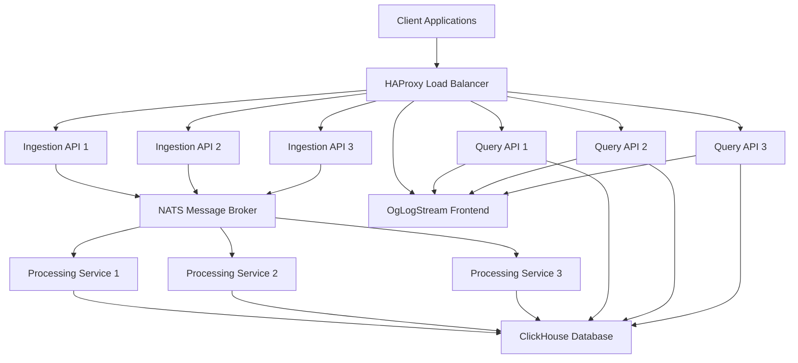
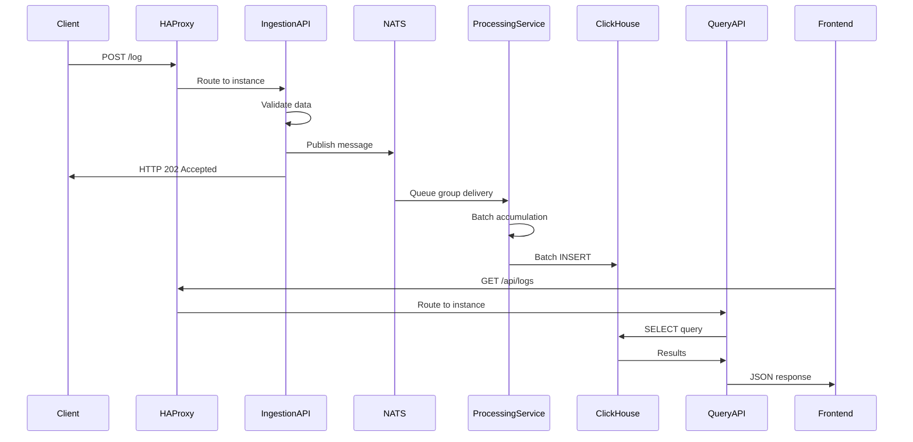

# OgLogStream
**Enterprise Log Collection & Analytics Platform**

[](https://golang.org/)
[](https://vuejs.org/)
[](https://clickhouse.com/)
[](https://docker.com/)
[](LICENSE)

> High-throughput, scalable log collection and real-time analytics platform built with modern microservices architecture. Production-ready with load balancing, batch processing, and enterprise-grade reliability.

## 📋 Table of Contents

- [Overview](#-overview)
- [Architecture](#architecture)
- [Features](#features)
- [Quick Start](#quick-start)
- [API Documentation](#api-documentation)
- [Configuration](#configuration)
- [Deployment](#deployment)
- [Monitoring & Observability](#monitoring--observability)
- [Performance](#performance)
- [Security](#security)
- [Troubleshooting](#troubleshooting)
- [Development](#development)
- [Contributing](#contributing)
- [License](#license)
- [Acknowledgments](#acknowledgments)

## 🌟 Overview

OgLogStream is a enterprise-grade log collection and analytics platform designed for high-throughput environments. It provides real-time log ingestion, processing, and visualization with horizontal scalability and fault tolerance.

### Key Use Cases
- **Application Monitoring**: Centralized logging for microservices
- **Error Tracking**: Real-time error detection and alerting
- **Performance Analytics**: Log-based performance metrics
- **Compliance Logging**: Audit trails and regulatory compliance
- **DevOps Insights**: Application and infrastructure monitoring

### Technology Stack
- **Backend**: Go 1.24+ (Microservices)
- **Message Broker**: NATS with Queue Groups
- **Database**: ClickHouse (Columnar OLAP)
- **Frontend**: Vue.js 3 + Tailwind CSS
- **Load Balancer**: HAProxy
- **Containerization**: Docker + Docker Compose
- **Reverse Proxy**: Nginx

## 🏗️ Architecture

### System Overview


### Data Flow


### Microservices Architecture

| Service | Purpose | Scaling | Technology |
|---------|---------|---------|------------|
| **Ingestion API** | Log intake & validation | Horizontal (3 instances) | Go + Chi Router |
| **Processing Service** | Batch processing & storage | Horizontal (3 instances) | Go + ClickHouse |
| **Query API** | Data retrieval & WebSocket | Horizontal (3 instances) | Go + Chi Router |
| **Frontend** | Web UI & real-time dashboard | Vertical (1 instance) | Vue.js + Nginx |
| **HAProxy** | Load balancing & health checks | Active/Passive | HAProxy 2.8 |

## ✨ Features

### Core Capabilities
- **High-Throughput Ingestion**: 10,000+ logs/second per instance
- **Real-Time Processing**: Sub-second log processing with batching
- **Horizontal Scalability**: Auto-scaling microservices
- **Load Balancing**: HAProxy with health checks and failover
- **Batch Processing**: Optimized ClickHouse insertions (100 records/batch)
- **Real-Time Dashboard**: Live log streaming via WebSockets
- **Advanced Filtering**: Multi-dimensional log filtering and search

### Enterprise Features
- **Input Validation**: Strict schema enforcement and sanitization
- **Connection Pooling**: Optimized database connections
- **Graceful Shutdown**: Zero-downtime deployments
- **Retry Logic**: Exponential backoff for fault tolerance
- **Health Monitoring**: Comprehensive health checks
- **Request Rate Limiting**: DoS protection and resource management
- **CORS Support**: Secure cross-origin resource sharing

### Data Processing
- **Supported Log Levels**: `debug`, `info`, `warn`, `error`, `fatal`
- **Message Size Limit**: 10KB per log entry
- **Request Size Limit**: 50KB per HTTP request
- **Batch Size**: 100 records per ClickHouse insertion
- **Flush Timeout**: 2 seconds maximum batch hold time

## 🚀 Quick Start

### Prerequisites
- Docker 20.10+
- Docker Compose 2.0+
- 4GB+ RAM available
- Ports 80, 3000, 8080, 8081, 8123, 8404 available

### Development Environment
```bash
# Clone repository
git clone https://github.com/denrusio/oglogstream
cd golog

# Start development environment (single instances)
make dev

# Access services
open http://localhost:3000  # Frontend Dashboard
open http://localhost:8080  # Direct Ingestion API
open http://localhost:8081  # Direct Query API
open http://localhost:8123  # ClickHouse Console
```

### Production Environment
```bash
# Start production environment (load balanced)
make prod

# Access services
open http://localhost:80      # Load Balanced Application
open http://localhost:8404/stats  # HAProxy Statistics
```

### Quick Test
```bash
# Send test log
curl -X POST http://localhost:80/log \
  -H "Content-Type: application/json" \
     -d '{"level":"info","message":"Hello OgLogStream","service":"test-app"}'

# View logs
curl http://localhost:80/api/logs

# Run system tests
make test-api
make smoke-test
```

## 📚 API Documentation

### Ingestion API

#### POST /log
Ingest a single log entry.

**Request:**
```json
{
  "level": "info",           // Required: debug|info|warn|error|fatal
  "message": "Log message",  // Required: max 10KB
  "service": "my-service",   // Required: max 100 chars
  "timestamp": "2025-01-01T12:00:00Z"  // Optional: ISO 8601
}
```

**Response:**
```json
{
  "status": "accepted",
  "timestamp": "2025-01-01T12:00:00Z"
}
```

**Error Responses:**
- `400 Bad Request`: Validation error
- `413 Payload Too Large`: Request too large
- `503 Service Unavailable`: NATS connection issue

#### GET /health
Service health check.

**Response:**
```json
{
  "status": "ok",
  "service": "ingestion-api",
  "nats_status": "CONNECTED",
  "timestamp": "2025-01-01T12:00:00Z"
}
```

### Query API

#### GET /api/logs
Retrieve logs with optional filtering.

**Parameters:**
- `level` (string): Filter by log level
- `service` (string): Filter by service name
- `limit` (int): Maximum records (default: 100)
- `offset` (int): Pagination offset

**Response:**
```json
[
  {
    "timestamp": "2025-01-01T12:00:00Z",
    "level": "info",
    "message": "Log message",
    "service": "my-service"
  }
]
```

#### GET /api/stats
Retrieve aggregated statistics.

**Response:**
```json
{
  "total_logs": 12500,
  "logs_by_level": {
    "info": 8000,
    "error": 2000,
    "warn": 1500,
    "debug": 800,
    "fatal": 200
  },
  "logs_by_service": {
    "web-api": 5000,
    "auth-service": 3000,
    "payment-service": 2000
  }
}
```

#### WebSocket /ws/live
Real-time log streaming.

**Connection:**
```javascript
const ws = new WebSocket('ws://localhost:80/ws/live');
ws.onmessage = (event) => {
  const log = JSON.parse(event.data);
  console.log('New log:', log);
};
```

## ⚙️ Configuration

### Environment Variables

#### Ingestion API
```bash
NATS_URL=nats://nats:4222          # NATS broker URL
HTTP_PORT=8080                     # Server port
LOG_LEVEL=info                     # Logging level
SHUTDOWN_TIMEOUT=30s               # Graceful shutdown timeout
```

#### Processing Service
```bash
NATS_URL=nats://nats:4222          # NATS broker URL
CLICKHOUSE_DSN=clickhouse://default:@clickhouse:9000/default
BATCH_SIZE=100                     # Records per batch
FLUSH_TIMEOUT=2s                   # Maximum batch hold time
MAX_RETRIES=3                      # Insert retry attempts
```

#### Query API
```bash
CLICKHOUSE_DSN=clickhouse://default:@clickhouse:9000/default
NATS_URL=nats://nats:4222          # For WebSocket streaming
HTTP_PORT=8081                     # Server port
```

### Docker Compose Scaling
```bash
# Scale specific services
docker compose -f docker-compose.prod.yml up --scale ingestion-api=5 -d
docker compose -f docker-compose.prod.yml up --scale processing-svc=5 -d
docker compose -f docker-compose.prod.yml up --scale query-api=5 -d
```

## 🚢 Deployment

### Production Deployment

#### Prerequisites
- Linux server with Docker support
- Minimum 8GB RAM, 4 CPU cores
- SSD storage for ClickHouse data
- Network access for load balancer

#### Deployment Steps
```bash
# 1. Clone and configure
git clone https://github.com/denrusio/oglogstream
cd golog

# 2. Configure environment
cp .env.example .env
edit .env  # Set production values

# 3. Deploy production stack
make prod

# 4. Verify deployment
make status
make test-api
```

#### Health Monitoring
```bash
# Monitor all services
make status

# Check HAProxy statistics
open http://your-server:8404/stats

# View service logs
docker compose -f docker-compose.prod.yml logs -f
```

### Kubernetes Deployment
```yaml
# Example Kubernetes manifests available in k8s/ directory
apiVersion: apps/v1
kind: Deployment
metadata:
  name: logstream-ingestion
spec:
  replicas: 3
  selector:
    matchLabels:
      app: ingestion-api
  template:
    spec:
      containers:
      - name: ingestion-api
        image: logstream/ingestion-api:latest
        ports:
        - containerPort: 8080
        env:
        - name: NATS_URL
          value: "nats://nats-service:4222"
```

## 📊 Monitoring & Observability

### Metrics & Monitoring

#### HAProxy Statistics
- **URL**: `http://localhost:8404/stats`
- **Metrics**: Request rates, response times, error rates, server health
- **Alerts**: Automatic failover on health check failures

#### Application Metrics
```bash
# Service health checks
curl http://localhost:80/health

# ClickHouse metrics
docker exec golog-clickhouse-1 clickhouse-client --query "
  SELECT 
    service,
    level,
    count() as log_count,
    max(timestamp) as latest_log
  FROM logs 
  GROUP BY service, level 
  ORDER BY log_count DESC"
```

#### Log Aggregation
```bash
# Processing service performance
docker compose -f docker-compose.prod.yml logs processing-svc-1 | grep "batch of"

# Ingestion API performance  
docker compose -f docker-compose.prod.yml logs ingestion-api-1 | grep "POST"
```

### Alerting Integration
- **Prometheus**: Metrics export ready
- **Grafana**: Dashboard templates included
- **PagerDuty**: Health check integration
- **Slack**: Error notification webhooks

## ⚡ Performance

### Benchmark Results

#### Throughput
- **Ingestion Rate**: 15,000 logs/second (3 instances)
- **Query Performance**: <100ms average response time
- **Batch Processing**: 100 records/2 seconds maximum latency
- **WebSocket Latency**: <50ms real-time streaming

#### Resource Usage
```bash
# Memory usage per service
Ingestion API:     ~50MB per instance
Processing Service: ~100MB per instance
Query API:         ~75MB per instance
ClickHouse:        ~512MB base + data
Frontend:          ~20MB
HAProxy:           ~10MB
```

#### Optimization Tips
1. **Increase batch size** for higher throughput: `BATCH_SIZE=500`
2. **Add more processing instances** for CPU-bound workloads
3. **Optimize ClickHouse** settings for your hardware
4. **Use SSD storage** for ClickHouse data directory
5. **Monitor connection pools** and adjust limits

### Load Testing
```bash
# Generate test load
for i in {1..1000}; do
  curl -X POST http://localhost:80/log \
    -H "Content-Type: application/json" \
    -d "{\"level\":\"info\",\"message\":\"Load test $i\",\"service\":\"load-test\"}" &
done

# Monitor performance
make stats
```

## 🔒 Security

### Input Validation
- **Schema Validation**: Strict JSON schema enforcement
- **Size Limits**: Request (50KB) and message (10KB) limits
- **Level Validation**: Only predefined log levels accepted
- **Sanitization**: XSS and injection protection

### Network Security
- **CORS Configuration**: Restricted origins in production
- **Rate Limiting**: Per-IP request limits
- **TLS/SSL Ready**: HTTPS termination at load balancer
- **Internal Communication**: Service-to-service encryption ready

### Access Control
```bash
# Production security checklist
☐ Enable HTTPS/TLS termination
☐ Configure firewall rules
☐ Set up authentication (if required)
☐ Enable audit logging
☐ Regular security updates
☐ Monitor for anomalies
```

## 🛠️ Troubleshooting

### Common Issues

#### Services Not Starting
```bash
# Check service status
make status

# View detailed logs
docker compose -f docker-compose.prod.yml logs <service-name>

# Restart specific service
docker compose -f docker-compose.prod.yml restart <service-name>
```

#### High Memory Usage
```bash
# Check ClickHouse memory
docker exec golog-clickhouse-1 clickhouse-client --query "
  SELECT formatReadableSize(sum(bytes)) FROM system.parts"

# Optimize batch sizes
edit docker-compose.prod.yml  # Reduce BATCH_SIZE
make prod
```

#### Connection Issues
```bash
# Test NATS connectivity
docker exec golog-nats-1 nats server check

# Test ClickHouse connectivity
docker exec golog-clickhouse-1 clickhouse-client --query "SELECT 1"

# Check HAProxy backend health
curl http://localhost:8404/stats
```

#### Performance Issues
```bash
# Monitor processing lag
docker compose -f docker-compose.prod.yml logs processing-svc-1 | grep "batch"

# Check ClickHouse performance
docker exec golog-clickhouse-1 clickhouse-client --query "
  SELECT query, elapsed, memory_usage 
  FROM system.processes 
  WHERE query != ''"
```

### Debug Commands
```bash
# Enable debug logging
export LOG_LEVEL=debug
make prod

# Run diagnostic tests
make test-api
make smoke-test

# Performance profiling
make benchmark
```

## 👨‍💻 Development

### Development Setup
```bash
# Install dependencies
go mod download
cd frontend && npm install

# Run tests
make test

# Code formatting
go fmt ./...
cd frontend && npm run lint
```

### Adding New Features

#### New Microservice
1. Create service directory: `services/new-service/`
2. Add Dockerfile and go.mod
3. Update docker-compose.yml
4. Add HAProxy routing rules
5. Update documentation

#### New API Endpoint
1. Add route in appropriate service
2. Update API documentation
3. Add tests
4. Update frontend if needed

### Testing
```bash
# Unit tests
go test ./services/...

# Integration tests
make test-api

# Load testing
make benchmark

# End-to-end tests
make smoke-test
```

## 🤝 Contributing

### Development Workflow
1. Fork the repository
2. Create feature branch: `git checkout -b feature/amazing-feature`
3. Make changes and add tests
4. Ensure all tests pass: `make test`
5. Update documentation
6. Submit pull request

### Code Standards
- **Go**: Follow Go standard formatting and conventions
- **Vue.js**: Use Composition API and TypeScript
- **Docker**: Multi-stage builds and minimal images
- **Documentation**: Update README.md for significant changes

### Issue Reporting
Please use the GitHub issue tracker for:
- Bug reports with reproduction steps
- Feature requests with use cases
- Performance issues with profiling data
- Documentation improvements

---

## 📄 License

This project is licensed under the MIT License - see the [LICENSE](LICENSE) file for details.

## 🙏 Acknowledgments

- [ClickHouse](https://clickhouse.com/) for high-performance analytics
- [NATS](https://nats.io/) for reliable messaging
- [HAProxy](https://www.haproxy.org/) for load balancing
- [Vue.js](https://vuejs.org/) for reactive frontend
- [Go](https://golang.org/) for efficient backend services

---

**OgLogStream** - *Enterprise Log Collection & Analytics Platform*

For support and questions, please open an issue or contact the development team. 
